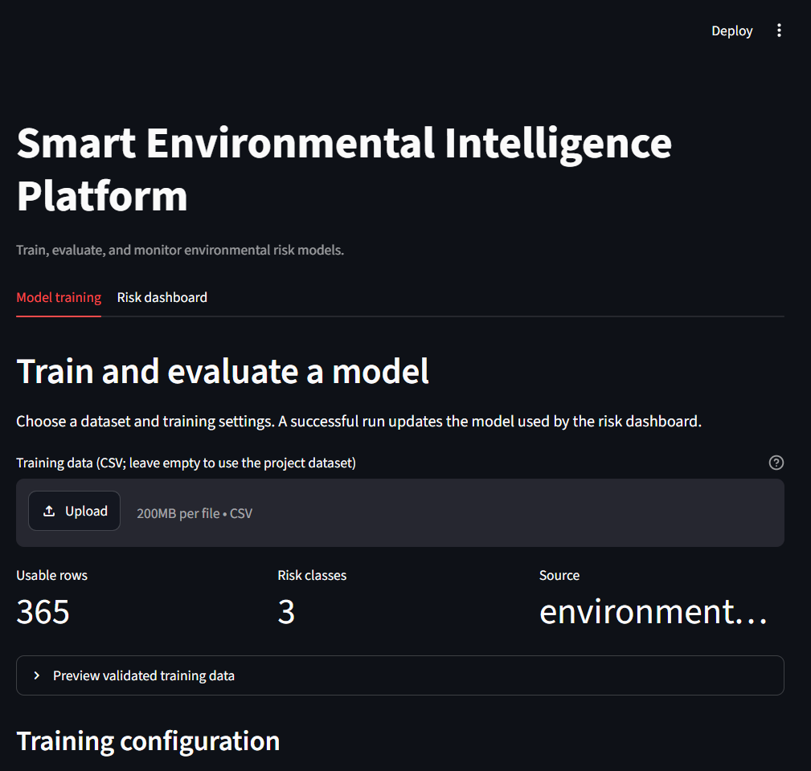
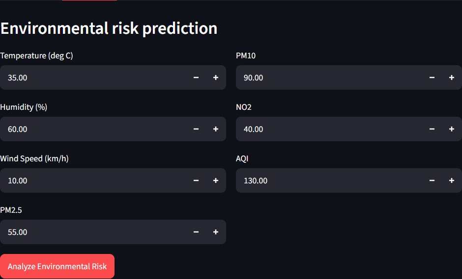

# Smart Environmental Intelligence

A machine learning project for monitoring and forecasting environmental conditions such as air quality, pollution, temperature, and risk alerts. This project provides a modular structure for data processing, feature engineering, model training, evaluation, and alert generation.

This directory is designed to be maintained as a standalone Git repository. Clone the URL for this project repository, then follow the setup instructions below.

## Dashboard Screenshots

### Model training



### Risk dashboard



## Project Goals

- Collect and clean environmental sensor and historical data
- Engineer meaningful features for analysis
- Train and compare predictive models
- Evaluate model performance and monitor results
- Trigger alerts for environmental risk conditions
- Provide a reusable foundation for future forecasting work

## Project Structure

```text
smart_environmental_intelligence/
├── data/
│   ├── raw/
│   └── processed/
├── models/
├── outputs/
├── src/
│   ├── alerts.py
│   ├── data_pipeline.py
│   ├── evaluate.py
│   ├── features.py
│   ├── logging_utils.py
│   ├── predict_service.py
│   ├── train.py
│   ├── train_models.py
│   ├── training_ui.py
│   └── __init__.py
├── tests/
├── app.py
├── train.py
├── README.md
├── requirements.txt
├── pytest.ini
├── config.py
└── .gitignore
```

## Standalone Repository Setup

Clone this project from its own remote repository:

```bash
git clone <repository-url>
cd smart_environmental_intelligence
```

Replace `<repository-url>` with the URL of the standalone repository.

## Environment Setup

1. Create and activate a virtual environment:

```bash
python -m venv .venv
source .venv/bin/activate   # Linux/macOS
.venv\Scripts\activate      # Windows
```

2. Install dependencies:

```bash
pip install -r requirements.txt
```

## Configuration

The project centralizes configuration in `config.py`. This file defines paths for the project folders, model output locations, and environment settings. Update these values if you move the project or change the default output directories.

## Typical Workflow

1. Prepare raw data inside `data/raw/`
2. Run the data pipeline to clean and transform the data
3. Engineer features or build model-ready datasets
4. Open the interactive training page and configure model parameters
5. Review evaluation results and artifacts in `outputs/`
6. Use the risk dashboard to make predictions with the newly trained model

## Interactive Training and Dashboard

Run from the project root after installing the requirements. Either command opens the Streamlit interface. Use the **Model training** tab to select a dataset, choose models, adjust training parameters with sliders, and train/evaluate. The **Risk dashboard** tab uses the latest saved model.

```powershell
python train.py
```

You can also start the interface directly with:

```powershell
streamlit run app.py
```

The training form compares logistic regression, random forest, classification
(decision) tree, and K-nearest neighbors (KNN). It exposes the holdout fraction,
stratified cross-validation folds, random seed, and model-specific parameters,
including tree criterion/depth, KNN neighbor count/weighting/distance metric, and
class weighting. KNN features are scaled inside the training pipeline. Random Forest
and KNN default to one worker to avoid process startup overhead on small datasets; the
dashboard lets you select 1, 2, or 4 workers for larger datasets. The default project
CSV is used unless another CSV is uploaded. A successful run replaces the saved model,
updates the model card, and writes evaluation results under `outputs/`.

## Dependencies

The project depends on common Python libraries for data science and ML workflows, including pandas, NumPy, scikit-learn, joblib, and Streamlit.

## Notes

- Keep all project configuration in `config.py`
- Keep input datasets in `data/`; local environments, caches, and generated artifacts are excluded by `.gitignore`
- Store generated models in `models/`
- Store visualizations and reports in `outputs/`
- Add unit tests under `tests/` for new functionality

## License

This project is licensed under the MIT License. See [LICENSE](LICENSE) for the full text.

## Citation

If you use this project in your work, cite it using the metadata in [CITATION.cff](CITATION.cff), or use GitHub's **Cite this repository** feature.
